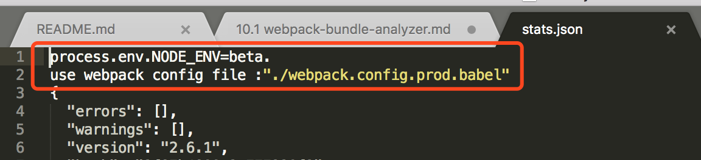

# webpack打包资源分析（webpack-bundle-analyzer使用）

## webpack-bundle-analyzer
[https://github.com/webpack-contrib/webpack-bundle-analyzer](https://github.com/webpack-contrib/webpack-bundle-analyzer)
``` bash
npm install -g webpack-bundle-analyzer
```

## webpack打包生成stat.json
``` bash
webpack --confifg webpack.build.config.js --profile --json > stats.json
```

## 分析stats.json
- FIXME: webpack生成的stats.json文件有问题，需要通过文本编辑器(推荐Sublime)打开删掉无关的信息 

``` bash
webpack-bundle-analyzer ./stats.json ./public/dist/
```

